1. Git Configuration Commands
## 1. git config --global user.name

### Syntax:
git config --global user.name "Your Name"

### Purpose:
Sets the global username that will be used in all Git commits.

### Example:
git config --global user.name "Venkat"

### Output:
Venkat

### Screenshot:
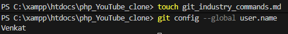

## 2. git config --global user.email

### Syntax:
git config --global user.email "your-email@example.com"

### Purpose:
Sets the global email address associated with Git commits.

### Example:
git config --global user.email "venkat@gmail.com"

### Output:
n220341@rguktn.ac.in

### Screenshot:
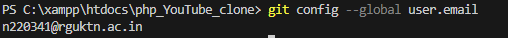

## 3. git config --list

### Syntax:
git config --list

### Purpose:
Displays all configured Git settings including username and email.

### Example:
git config --list

### Output:
user.name=Venkat
user.email=n220341@rguktn.ac.in

### Screenshot:
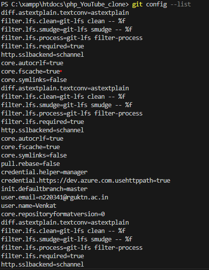

## 4. git config --unset

### Syntax:
git config --global --unset user.name

### Purpose:
Removes a Git configuration value.

### Example:
git config --global --unset user.name

### Output:
(No output if successfully removed)

### Screenshot:
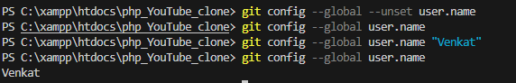

2. Repository Setup Commands
## 1. git init

### Syntax:
git init

### Purpose:
Initializes a new Git repository in the current directory.

### Example:
git init

### Output:
Initialized empty Git repository

### Screenshot:
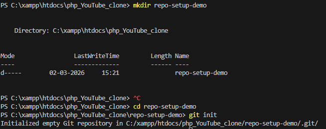

## 2. git clone

### Syntax:
git clone <repository-url>

### Purpose:
Creates a local copy of a remote repository.

### Example:
git clone  https://github.com/venkat-n220341/WTLab_n220341.git

### Output:
Cloning into 'repository'...

### Screenshot:
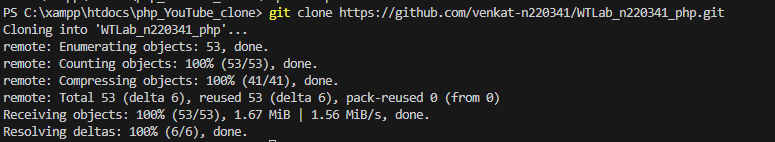

## 3. git clone --branch

### Syntax:
git clone --branch <branch-name> <repository-url>

### Purpose:
Clones a specific branch instead of the default branch.

### Example:
git clone --branch test-branch git clone https://github.com/venkat-n220341/WTLab_n220341.git

### Screenshot:
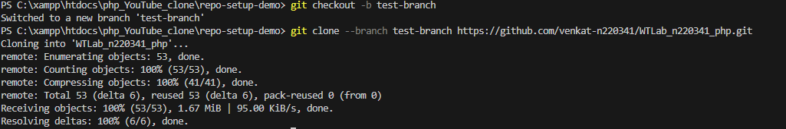

## 4. git clone --depth

### Syntax:
git clone --depth <number> <repository-url>

### Purpose:
Performs a shallow clone with limited commit history.

### Example:
git clone --depth 1 https://github.com/venkat-n220341/WTLab_n220341.git

### Screenshot:
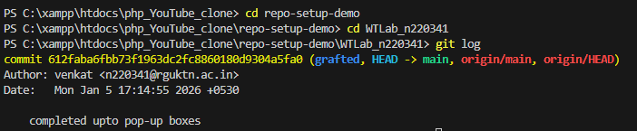

3. Repository Status & Inspection
## 1. git status

### Syntax:
git status

### Purpose:
Displays the current state of the working directory and staging area.

### Example:
git status

### Screenshot:
!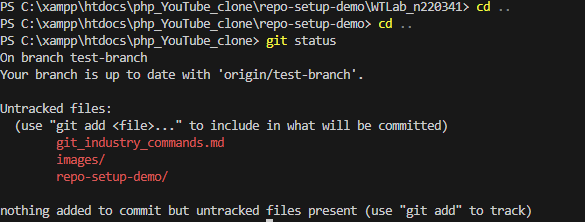

## 2. git log

### Syntax:
git log

### Purpose:
Displays detailed commit history.

### Example:
git log

### Screenshot:
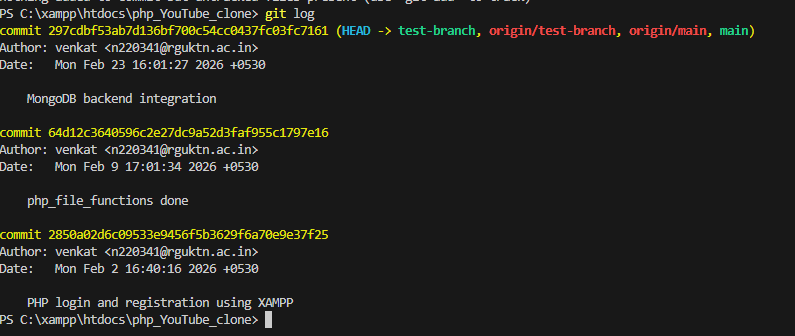

## 3. git log --oneline

### Syntax:
git log --oneline

### Purpose:
Displays commit history in a compact one-line format.

### Screenshot:
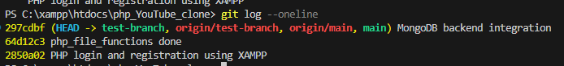

## 4. git log --graph

### Syntax:
git log  --graph --all

### Purpose:
Displays commit history in graphical branch format.

### Screenshot:
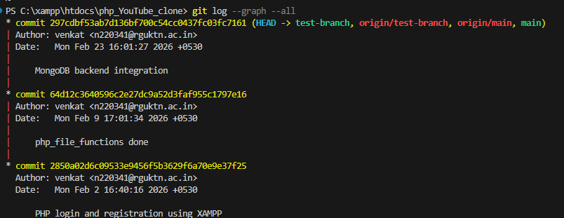

## 5. git show

### Syntax:
git show <commit-id>

### Purpose:
Displays detailed information about a specific commit.

### Screenshot:
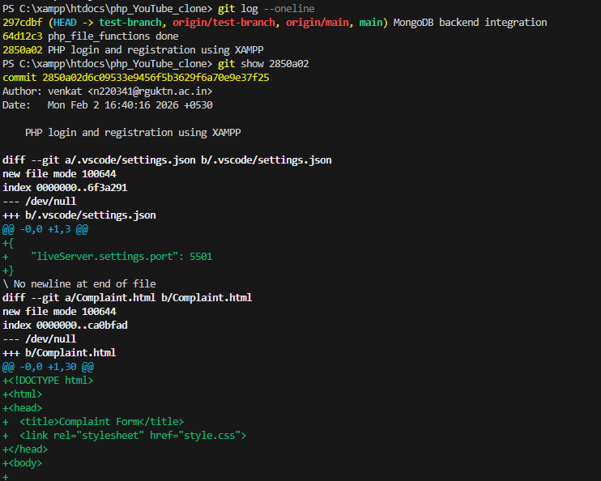

## 7. git diff --staged

### Syntax:
git diff --staged

### Purpose:
Shows differences between staging area and last commit.

### Screenshot:
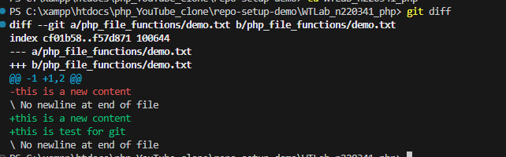

## 9. git reflog

### Syntax:
git reflog

### Purpose:
Displays reference log of HEAD movements.

### Screenshot:
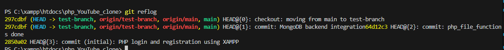

## 10. git shortlog

### Syntax:
git shortlog

### Purpose:
Summarizes commit history grouped by author.

### Screenshot:
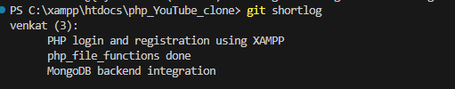

4. File Tracking Commands
## 1. git add

### Syntax:
git add <file-name>

### Purpose:
Stages a specific file for the next commit.

### Example:
git add demo.txt

### Screenshot:
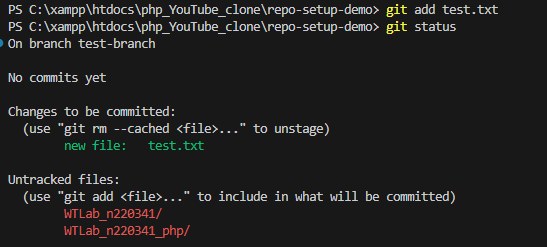

## 2. git add .

### Syntax:
git add .

### Purpose:
Stages all modified and new files in the repository.

### Screenshot:

## 3. git add -p

### Syntax:
git add -p <file-name>

### Purpose:
Stages changes interactively in small sections.

### Screenshot:

## 4. git restore

### Syntax:
git restore <file-name>

### Purpose:
Discards changes in working directory.

### Screenshot:

## 5. git restore --staged

### Syntax:
git restore --staged <file-name>

### Purpose:
Removes a file from the staging area without deleting changes.

### Screenshot:

## 6. git rm

### Syntax:
git rm <file-name>

### Purpose:
Removes a file from working directory and stages the deletion.

### Screenshot:

## 7. git mv

### Syntax:
git mv <old-name> <new-name>

### Purpose:
Renames a file and stages the change automatically.

### Screenshot:

5. commit commands

## 1. git commit

### Syntax:
git commit

### Purpose:
Creates a commit and opens editor to enter commit message.

### Example:
git commit

### Screenshot:

## 2. git commit -m

### Syntax:
git commit -m "message"

### Purpose:
Creates a commit with message directly from terminal.

### Example:
git commit -m "Updated commit demo file"

### Screenshot:

## 3. git commit --amend

### Syntax:
git commit --amend

### Purpose:
Modifies the most recent commit.

### Example:
git commit --amend

### Screenshot:

## 4. git commit --no-edit

### Syntax:
git commit --amend --no-edit

### Purpose:
Amends the last commit without modifying commit message.

### Example:
git commit --amend --no-edit

### Screenshot:

6. Branch Management commands
## 1. git branch

### Syntax:
git branch

### Purpose:
Lists all local branches in the repository.

### Example:
git branch

### Screenshot:

## 2. git branch -a

### Syntax:
git branch -a

### Purpose:
Displays all local and remote branches.

### Screenshot:

## 3. git checkout -b

### Syntax:
git checkout -b <branch-name>

### Purpose:
Creates a new branch and switches to it.

### Example:
git checkout -b feature-branch

### Screenshot:

## 4. git checkout

### Syntax:
git checkout <branch-name>

### Purpose:
Switches to an existing branch.

### Example:
git checkout main

### Screenshot:

## 5. git switch

### Syntax:
git switch <branch-name>

### Purpose:
Switches to another branch.

### Screenshot:

## 6. git switch -c

### Syntax:
git switch -c <branch-name>

### Purpose:
Creates and switches to a new branch.

### Screenshot:

## 7. git branch -d

### Syntax:
git branch -d <branch-name>

### Purpose:
Deletes a branch safely.

### Screenshot:

## 8. git branch -D

### Syntax:
git branch -D <branch-name>

### Purpose:
Force deletes a branch.

### Screenshot:

7. Merge & Integration Commands

## 1. git merge

### Syntax:
git merge <branch-name>

### Purpose:
Combines changes from one branch into the current branch.

### Example:
git merge merge-demo

### Screenshot:

## 2. git merge --no-ff

### Syntax:
git merge --no-ff <branch-name>

### Purpose:
Creates a merge commit even when fast-forward merge is possible.

### Example:
git merge --no-ff feature-merge

### Screenshot:

8. Remote Repository Commands
## 1. git remote

### Syntax:
git remote

### Purpose:
Displays remote repository names.

### Screenshot:

## 2. git remote -v

### Syntax:
git remote -v

### Purpose:
Displays remote repository URLs.

### Screenshot:

## 3. git remote add

### Syntax:
git remote add <name> <url>

### Purpose:
Adds a new remote repository.

### Example:
git remote add upstream https://github.com/example/repo.git

### Screenshot:

## 4. git remote remove

### Syntax:
git remote remove <name>

### Purpose:
Removes a remote repository.

### Screenshot:

## 5. git fetch

### Syntax:
git fetch

### Purpose:
Downloads changes from remote repository without merging.

### Screenshot:

## 6. git fetch --all

### Syntax:
git fetch --all

### Purpose:
Fetches changes from all remote repositories.

### Screenshot:

## 7. git pull

### Syntax:
git pull

### Purpose:
Fetches and merges remote changes.

### Screenshot:

## 8. git pull --rebase

### Syntax:
git pull --rebase

### Purpose:
Fetches remote changes and rebases local commits.

### Screenshot:

## 9. git push

### Syntax:
git push

### Purpose:
Pushes local commits to remote repository.

### Screenshot:

## 10. git push -u origin

### Syntax:
git push -u origin <branch-name>

### Purpose:
Pushes branch and sets upstream tracking.

### Screenshot:

## 11. git push --force

### Syntax:
git push --force

### Purpose:
Force pushes changes to remote repository.

### Screenshot:

9. Stash Commands
## 1. git stash

### Syntax:
git stash

### Purpose:
Temporarily saves uncommitted changes.

### Screenshot:

## 2. git stash list

### Syntax:
git stash list

### Purpose:
Displays all saved stash entries.

### Screenshot:

## 3. git stash apply

### Syntax:
git stash apply

### Purpose:
Applies saved stash without removing it.

### Screenshot:

## 4. git stash pop

### Syntax:
git stash pop

### Purpose:
Applies stash and removes it from stash list.

### Screenshot:

## 5. git stash drop

### Syntax:
git stash drop stash@{0}

### Purpose:
Deletes a specific stash entry.

### Screenshot:

## 6. git stash clear

### Syntax:
git stash clear

### Purpose:
Deletes all stash entries.

### Screenshot:

10. Reset & Undo Commands
## 1. git reset

### Syntax:
git reset HEAD~1

### Purpose:
Moves HEAD to previous commit while keeping changes.

### Screenshot:

## 1. git reset

### Syntax:
git reset HEAD~1

### Purpose:
Moves HEAD to previous commit while keeping changes.

### Screenshot:

## 3. git reset --mixed

### Syntax:
git reset --mixed HEAD~1

### Purpose:
Undo commit and unstage changes.

### Screenshot:

## 4. git reset --hard

### Syntax:
git reset --hard HEAD~1

### Purpose:
Undo commit and delete changes permanently.

### Screenshot:

## 5. git revert

### Syntax:
git revert <commit-id>

### Purpose:
Creates a new commit that undoes previous commit.

### Screenshot:

## 6. git clean -f

### Syntax:
git clean -f

### Purpose:
Deletes untracked files.

### Screenshot:

## 7. git clean -fd

### Syntax:
git clean -fd

### Purpose:
Deletes untracked files and directories.

### Screenshot:

12. cherry pick and patch commands
## 1. git cherry-pick

### Syntax:
git cherry-pick <commit-id>

### Purpose:
Applies specific commit from another branch.

### Screenshot:

## 1. git cherry-pick

### Syntax:
git cherry-pick <commit-id>

### Purpose:
Applies specific commit from another branch.

### Screenshot:

## 3. git apply

### Syntax:
git apply <patch-file>

### Purpose:
Applies patch file to working directory.

### Screenshot:

